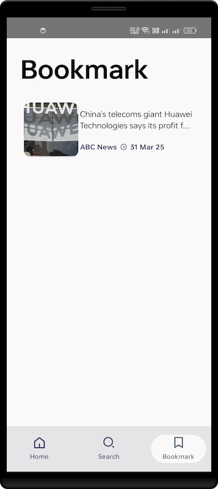

# News App

## Overview

This is a News Application built using Jetpack Compose, Room, and other modern Android development tools. It features search functionality, detailed news views, bookmarking, and local data storage.

## Features

* **Search:** Allows users to search for news articles based on keywords.
* **Detail Screen:** Displays a partial story with an option to open the full article in the device's browser.
* **Bookmarks:** Users can bookmark articles for later reading.
* **Local Storage:** Uses Room to store bookmarked articles locally.
* **Jetpack Compose:** Modern UI toolkit for building native Android UI.
* **Room Persistence Library:** For local data storage.
* **Hilt:** For dependency injection.
* **Kotlin Coroutines:** For asynchronous operations.
* **Navigation Compose:** For in app navigation.
* **Accompanist System UI Controller:** For controlling the system UI from compose.
* **DataStore:** For storing user preferences.

## Dependencies

* Jetpack Compose
* Room
* Hilt
* Kotlin Coroutines
* Navigation Compose
* Accompanist System UI Controller
* DataStore
* Kotlin Parcelize

### 📱 Screenshots

| Home Screen                                      | Detail Screen                                               |
|--------------------------------------------------|-------------------------------------------------------------|
|  |  |

| Search Screen                                | Bookmark Screen                                  |
|----------------------------------------------|--------------------------------------------------|
|  |  |

